# QtLearning
Exercises from Graphics And Multimedia Labs about all kind of algorithms connected to paiting/drawing shapes on computer's screen
The project has 6 sections:
- Curves,
- QtLearning,
- ModeleBarw (in Engilsh color Palette RGB, HSV),
- BlendModes
- 2D transforming (przeksztalcenia)
- Texturing
- 3D transforming (bryla3D)

***
### CURVES
The curves is about B-spline curve and Bezier curve. User of this simple program can chose certain points and it will be drawn
a curve depends of points. User can also delete points and change their position.
\* you can change between line which want to draw in source code (comment or uncomment between Bezier and Bsplines):
```
curves/mywidget.cpp:38-39
curves/mywidget.cpp:47-48
```

#### B-spline curve:
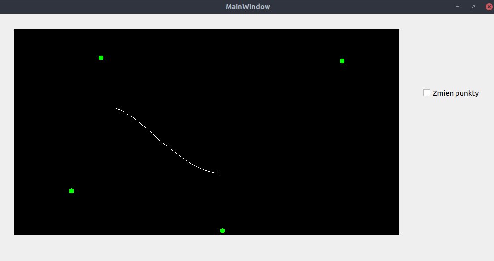
#### Bezier curve:
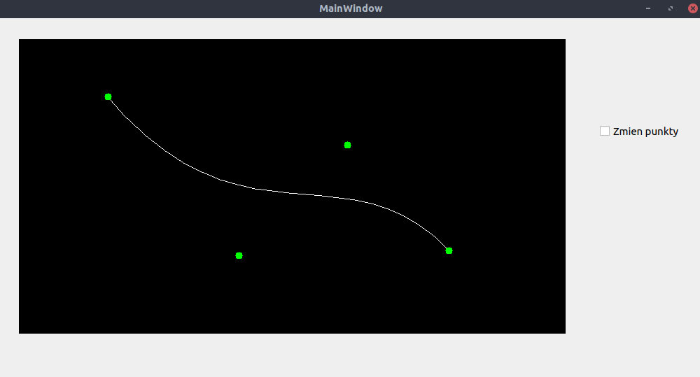

***
### MODELE BARW
modeleBarw is about conversion pixels' colors from RGB to HSV and from HSV to RGB. User can change every channel (H, S ,V).
It has impact on image's result.

#### Original image:
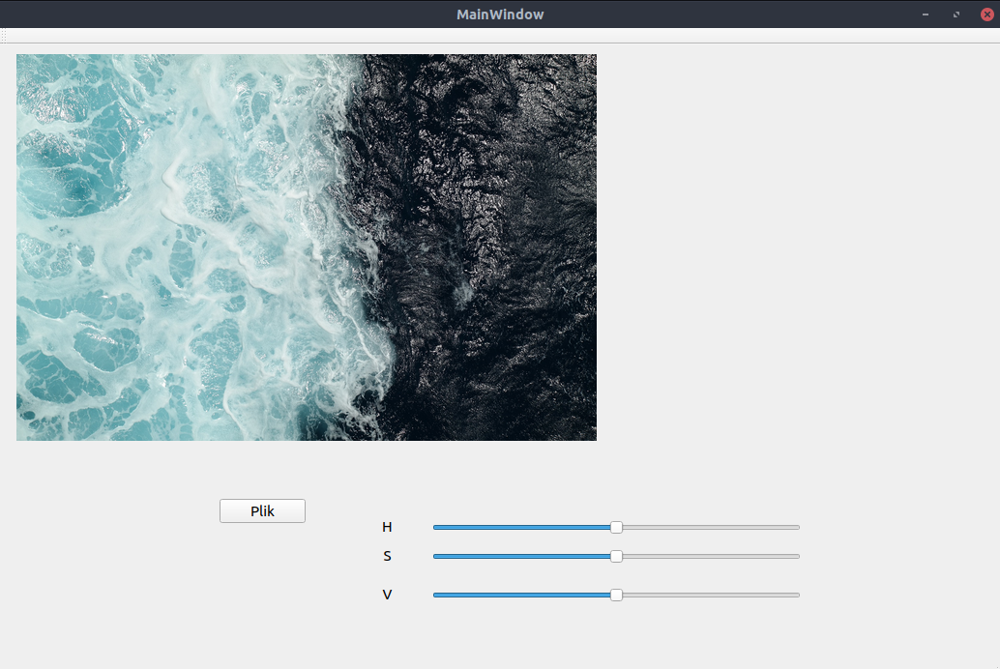
#### After chanels' change:
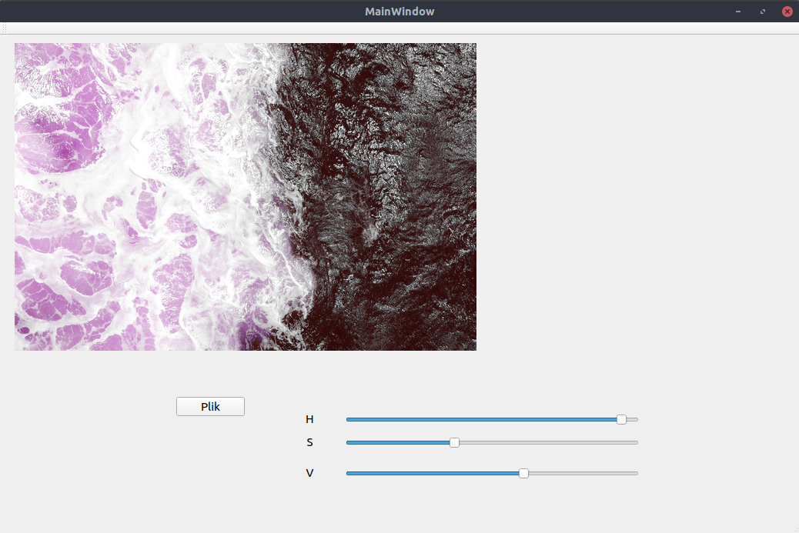

***
### QTLEARNING
QtLearning is about:
- Drawing basic shapes like circles, elipses, rectagles, rectagles' frames, paiting with sprays,
- FloodFill algorithm which flood shapes with color chosen by user,
- ScanLine algorithm which draws irregular polygons,
user chose points, connection between pairs creates edge, then it fills inside of shape with color using scanLine algorithm(liny by line),
- Morphology operations e.g dilation, erosion.


#### Drawing shapes:
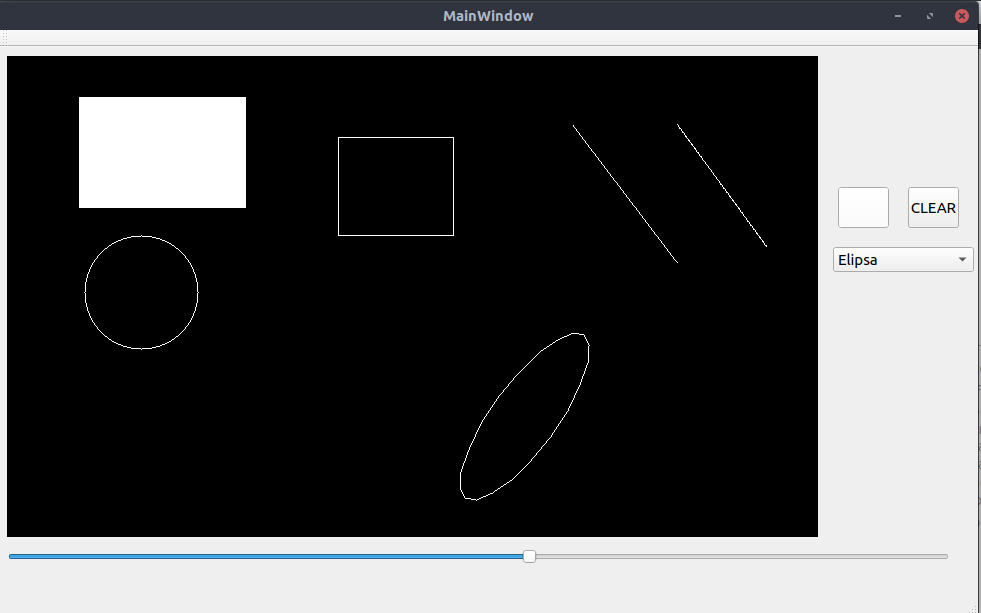

#### Flood fill algorithm:
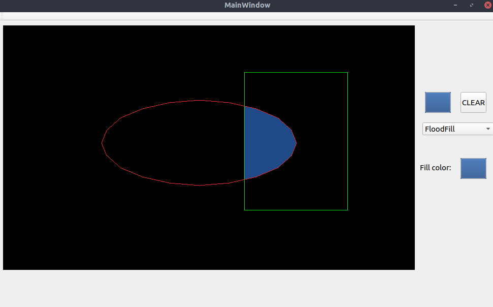

#### Scan line:
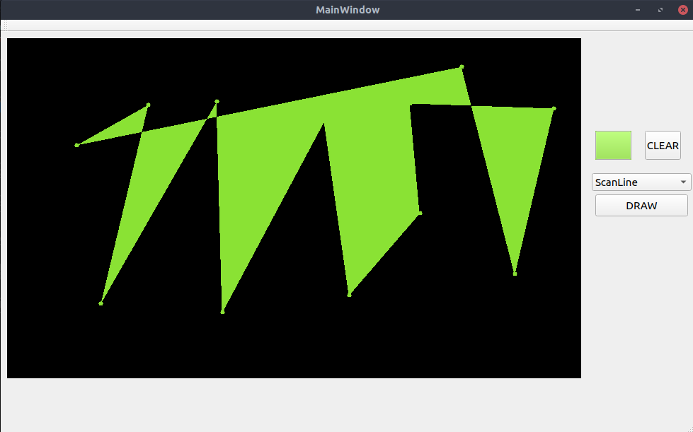

#### Morphology Operations:
##### Before:
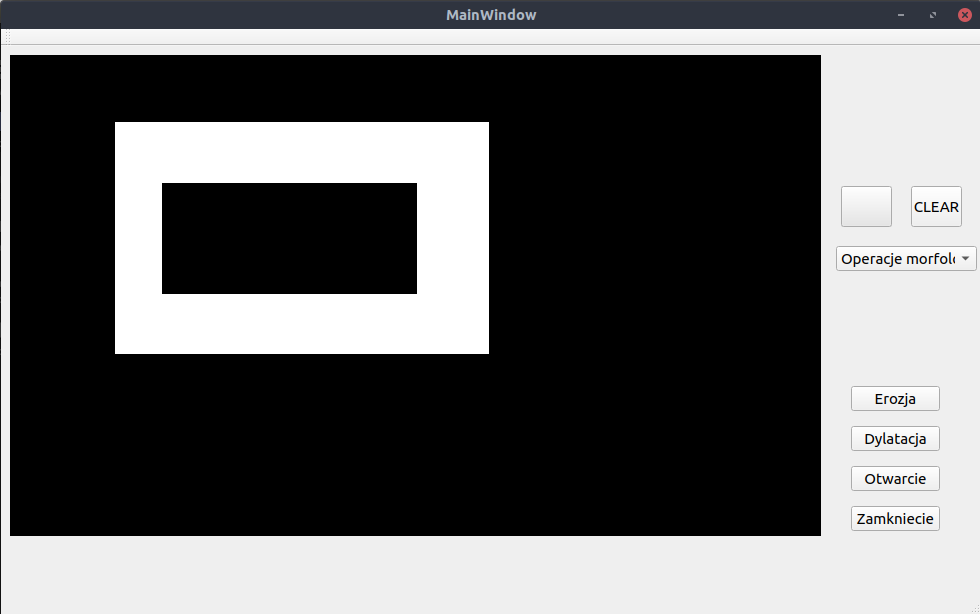
##### Before:
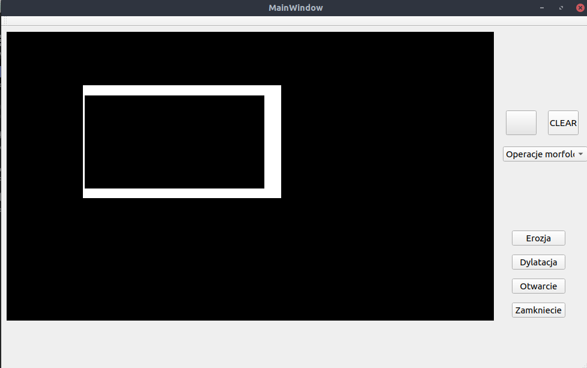
***
### BLENDMODES
Blend modes project is about mixing layers using blend modes. I use modes like normal, average, multiply, darken, lighten, screen.
Program is easy expandable with new blend functions. There are 3 permanently chosen images as layers, they have the same dimension (each width and height of images are the same)
to make code easier to write and rather focus on blend modes than on user's interface and scalability of image.

#### Example of mix:


#### Layers 0:


#### Layers 1:
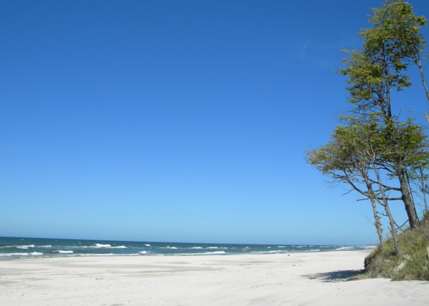

#### Layers 2:


***
### 2D TRANSFORMING
This section is about transforming on 2D Image e.g scale, rotation, shearing, translation. The result is computed using translation matrix and homogeneous coordinates. I only change coordinates of vertcices, not every pixel on image. The image is very simple, kind of house. After changing coordiantes of vertices there are drown lines between them.

#### Orginal Image:
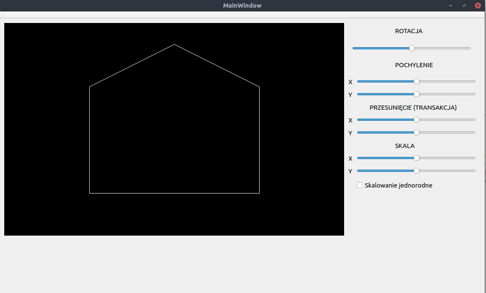

#### After transfoming:
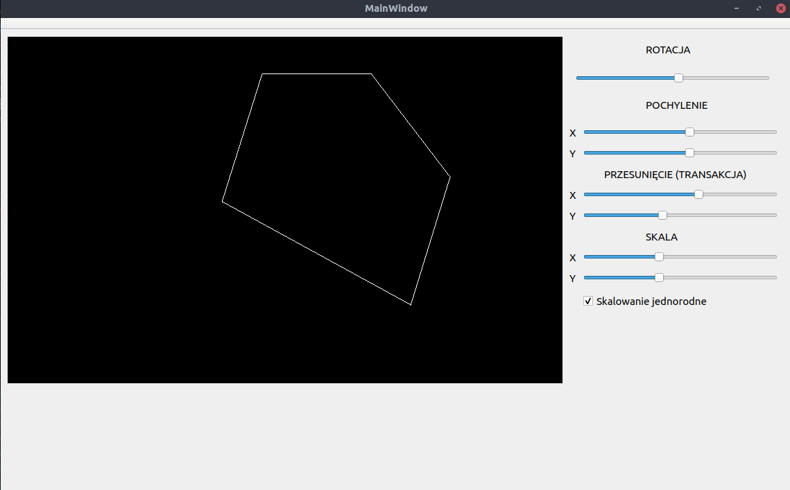

***
### TEXTURING
Texturing is about simple presenting a fragment of bitmap on black image. I use only one traingle. User chose 3 vertices on black image and 3 vertices on bitmap iamge. Then the triangle on bitmap is mapped to triangle on black image. After checking checkBox "zmień punkty" user can move vertices as on bitmap as on black image.

#### Texturing:
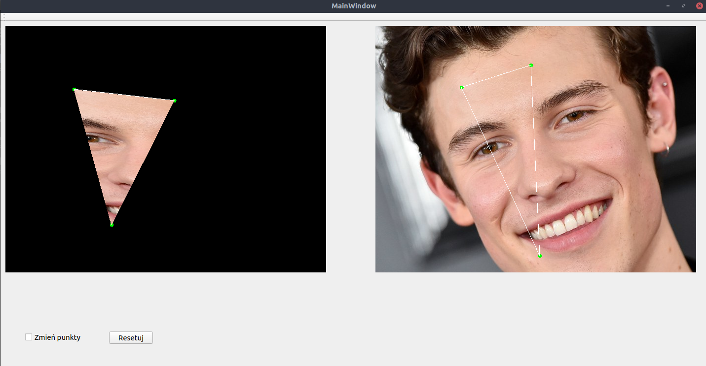

***
### 3D transforming
Here we have a simple cube, which we can rotate, change its position, scale it and shear it by using adequate sliders. The result image is shown in parallel projection. It is changeable to perspective projection by check checkBox. x, y, z is scalable separately or together(homogeneous scaling) after checking an other checkBox.

#### Cube:
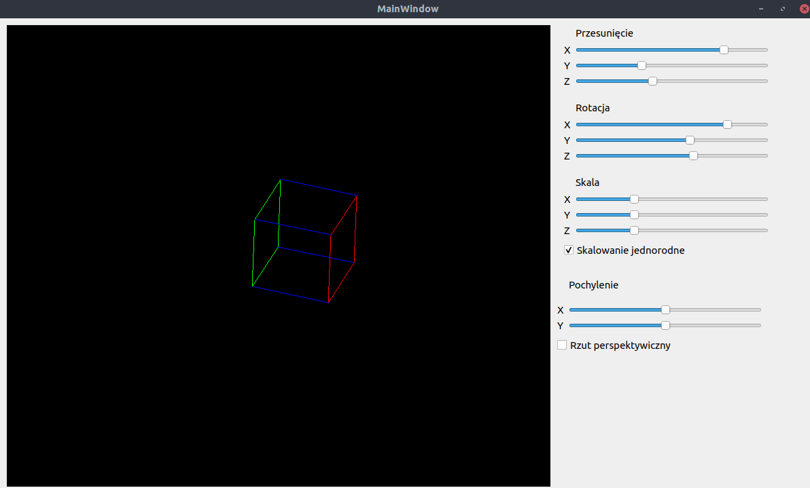


# Development
1. Clone repo to your device eg.:
    ```
    git clone https://github.com/marcinbedcyc/QtLearning.git
    ```
1. Open selected project in QtCreator eg. curves. File > Open File or Project and choose curves.pro.
1. Run with QtCreator GUI.

\* If you have some problems with open projects try to remove all *.user files and open again.